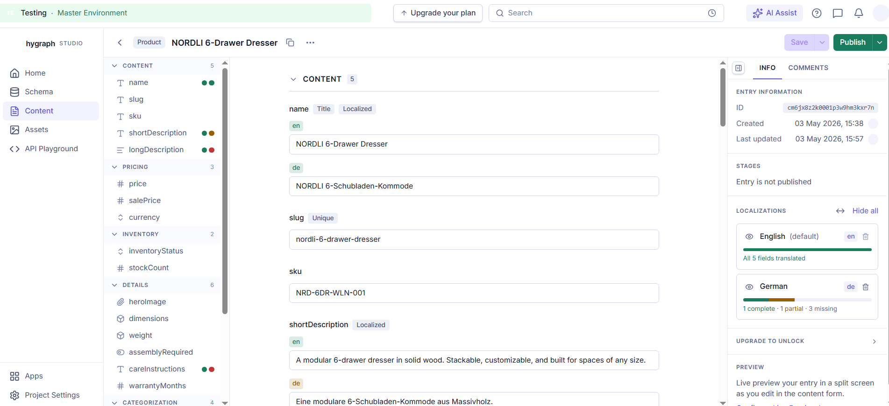
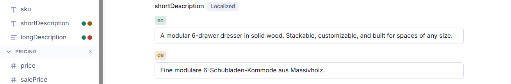
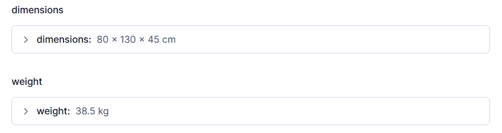
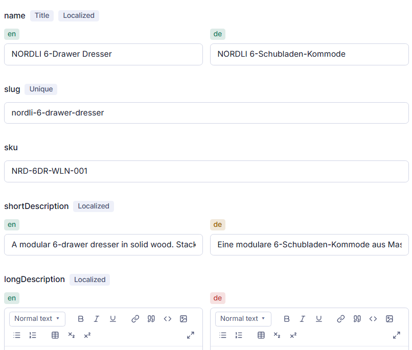
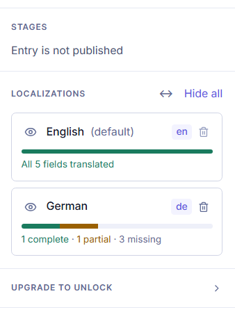
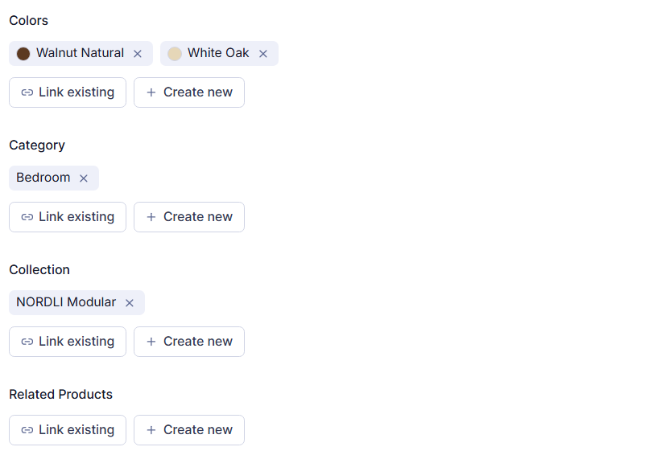

# Hygraph Studio - Content Editor Rebuild

**Live demo:** https://heliavz.github.io/hygraph-studio-editor/

A frontend rebuild of [Hygraph](https://hygraph.com)'s Studio content editor, shipping four targeted UX improvements drawn from a friction journal of 21 observations made while using the live product. Built as a portfolio piece.

> This is not an official Hygraph product. It is an independent rebuild with the explicit goal of identifying real frictions in the editor surface and proposing concrete improvements.



---

## Why this project

Hygraph positions itself as the easiest headless CMS to implement. The editor surface is where that promise either holds or breaks down. It is where editors spend the majority of their time, and where small frictions compound into hours of friction per week per user.

I built a real Product schema (3 enums, 2 components, 4 models, 22 fields), populated one entry through to the publish step, and logged every usability friction I encountered as I went. 21 frictions surfaced in roughly 45 minutes of focused use. Four of them are addressed in this rebuild. The full journal, including the seventeen frictions I did not ship fixes for, with notes on why, is in [FRICTIONS.md](./FRICTIONS.md).

The four improvements were chosen because they could each be addressed entirely in the frontend, they affect every editor on every entry rather than edge cases, and together they demonstrate four distinct categories of UX work: information surfacing, information hiding, data display, and language consistency.

---

## What was improved

### 1. Localization completion at a glance - F21



**Problem:** The original editor surfaces no signal to answer the question "is this entry fully translated?" The right-rail localization list shows which locales exist on the entry but not how complete each one is. To audit translation completeness, an editor must open every localized field and visually compare the source and target locales.

**Improvement:** Per-locale completion is surfaced at two altitudes.

- **Per-field:** every localized field carries a small status dot per locale, green for complete, amber for partial, red for empty. Visible in the field outline column on the left, so editors see missing translations without scrolling the form.
- **Per-entry:** the right rail's Localizations section aggregates field-level status into a per-locale completion bar with explicit counts (`1 complete · 1 partial · 3 missing`). The default English locale shows `All 5 fields translated`; the German locale shows the partial breakdown.

The field outline doubles as navigation: clicking a field name jumps the form to that field. The same column that surfaces _what's missing_ takes the editor _to where it is_.

---

### 2. Component fields show values, not UUIDs - F14



**Problem:** When a component field (Dimensions, Weight) is collapsed in the editor form, the original Hygraph displays the underlying entry's hash ID; for example, `Dimensions: ba9087ece27945568ae457931cfb34ee`. For an editor reviewing a long form, the collapsed state is useless: they cannot verify the component's content without expanding it, defeating the purpose of collapsing it in the first place.

**Improvement:** Components synthesize a human-readable summary from their field values. The Dimensions component renders as `80 × 130 × 45 cm`, the Weight component as `38.5 kg`. The synthesis is per-component-type, configured alongside the field schema. An editor scanning the form for the right product can verify content at a glance without expanding anything.

---

### 3. Side-by-side localization view - F18



**Problem:** Localized fields render as a vertical stack of locale variants. The pattern works for two locales but degrades non-linearly as more are added. Editors translating between languages must scroll up and down to compare source and target, and there is no way to see them aligned. The scroll cost compounds for long-form fields like rich text descriptions.

**Improvement:** A `↔` toggle in the right rail's Localizations section switches every localized field between stacked and side-by-side layouts. The toggle is global to the entry, so the editor picks the layout that matches the task, translators get the comparison view, mono-locale editors keep the stacked view.

The right rail's per-locale completion bars (from improvement #1) are also visible in this screenshot, alongside the side-by-side fields.



---

### 4. Unified verbs for reference actions - F17



**Problem:** Action buttons for attaching referenced entries use multiple different verb patterns across one editor form. A single Product entry can present "Add existing entries / Create new entry" on one field, "Replace X / Create & replace X" on another, "Add existing X / Create new X" on a third, "Add X" on assets, and "Replace X" on single-asset fields. The same underlying action, attach a reference is expressed five different ways within a single form. Editors re-parse each field's vocabulary instead of pattern-matching.

**Improvement:** Every reference field, single, multi, asset, model-to-model, uses the same two verbs: `Link existing` and `Create new`. Cardinality is communicated by other affordances (chip stack vs single chip, presence of `×` to remove a link), not by verb choice. Editors learn one vocabulary and apply it everywhere.

---

## Stack

- [Next.js](https://nextjs.org/) (App Router) with static export, deployed to GitHub Pages
- [TypeScript](https://www.typescriptlang.org/)
- [Tailwind CSS v4](https://tailwindcss.com/) with design tokens lifted from Hygraph's own UI
- [lucide-react](https://lucide.dev/) for icons
- [Inter](https://fonts.google.com/specimen/Inter) for typography

The chrome, colors, type scale, spacing, icon set is matched closely to the live Hygraph editor. Design tokens were extracted by inspecting the running app and codified in `globals.css` so the rebuild reads as visually faithful, not as "a generic CMS UI."

---

## Design decisions worth naming

A few decisions in the rebuild deviate from the original on purpose. They are documented here so reviewers can recognize them as choices, not oversights.

**Sections in the form area.** The original Hygraph editor renders all 22 fields as a flat list with per-field collapse chevrons. This rebuild groups fields into six editorial sections (Content, Pricing, Inventory, Details, Categorization, SEO & Visibility) with per-section collapse. With 22 fields, sections do more work than per-field chevrons. They let editors skip whole categories of irrelevance ("I'm only editing pricing today"). Per-field collapse was retired alongside this change.

**Fixture data is intentionally incomplete.** The Product entry has English content for all five localized fields; German has full translations for `name` and `shortDescription`, and is intentionally empty for `longDescription`, `careInstructions`, and `metaDescription`. The asymmetry exists to make improvement #1 (locale completion) demonstrable. An entry where everything is fully translated would render five identical green bars and tell the reviewer nothing about the friction the improvement addresses.

**Interactivity is scoped.** This is a static rebuild for portfolio purposes, not a working CMS. The four improvements are interactive (collapse sections, toggle layout, expand the upgrade panel, click locale completion bars). Other affordances, Save, Publish, the search bar, locale removal render with full visual fidelity but no behavior. The compromise is deliberate: it lets the rebuild demonstrate UX choices without pretending to ship features it doesn't have.

---

## What's next - identified but not built

Frictions logged but not addressed in this rebuild, in rough priority order:

- **Inline AI translation (F19):** Surface "Translate from English" as an action on each empty target-locale field, calling Hygraph's existing AI Assist endpoint. Highest leverage of the deferred items.
- **Schema-page editor preview (F12):** A live preview pane in the schema view, showing the editor form as fields are configured. Closes the modeling-to-editing feedback loop.
- **Reference chip naming (F16):** Reference chips in the editor display API IDs (`ColorApi`) instead of human display names (`Color`). Small fix, broad surface.
- **Per-entry completion in the entry list:** Improvement #1 lives at field and entry altitude. The next altitude up, the Content tab's entry list would surface completion bars per entry, so editors can find "all entries missing German" without opening each one.
- **Field-tag visual differentiation (F4):** Field cards in the schema view show all metadata tags (type, constraint, localization) with identical chrome. Cross-cutting questions ("which fields are localized?") become O(n) scans instead of O(1).

The full deferred list and the rationale for what was and wasn't shipped is in [FRICTIONS.md](./FRICTIONS.md).

---

## Running locally

```bash
git clone https://github.com/heliavz/hygraph-studio-editor.git
cd hygraph-studio-editor
npm install
npm run dev
```

Open [http://localhost:3000](http://localhost:3000) in your browser.

To produce the static build that is deployed to GitHub Pages:

```bash
npm run build
```

The output lands in `out/` and is deployed by the GitHub Actions workflow on every push to `main`.

---

## Repository structure

```text
src/
├── app/
│   ├── page.tsx                   # Editor page, owns collapsed sections + view mode state
│   ├── layout.tsx                 # Root layout
│   └── globals.css                # Tailwind directives and brand design tokens
├── components/
│   └── editor/
│       ├── TopBar.tsx             # Top navigation bar with workspace switcher and search
│       ├── LeftSidebar.tsx        # App nav (Home, Schema, Content, Assets, API Playground)
│       ├── EntryHeader.tsx        # Entry breadcrumb, Save and Publish buttons
│       ├── FieldOutline.tsx       # Collapsible field outline with locale completion dots
│       ├── RightRail.tsx          # Info panel, localizations, stages, upgrade section
│       └── form/
│           ├── EditorForm.tsx     # Form shell, section grouping, collapse logic
│           ├── FormField.tsx      # Field wrapper with label and type pills
│           ├── LocalizedTextInput.tsx  # Text and rich text fields with locale chips
│           ├── TextInput.tsx      # Single-locale text input
│           ├── NumberInput.tsx    # Numeric input
│           ├── EnumSelect.tsx     # Dropdown for enum fields
│           ├── BooleanToggle.tsx  # Toggle for boolean fields
│           ├── AssetField.tsx     # Asset reference field
│           ├── ComponentField.tsx # Component field with human-readable summary
│           └── ReferenceField.tsx # Reference field with unified Link/Create verbs
└── data/
    ├── types.ts                   # Product, Locale, and field type definitions
    ├── schema.ts                  # Field definitions, sections, and field ordering
    ├── product.ts                 # NORDLI fixture data (intentionally partial German)
    ├── references.ts              # Color, Category, Collection reference fixtures
    ├── completion.ts              # Locale completion status helpers
    └── index.ts                  # Barrel export
```

---

## Context

The goal was to go beyond a standard portfolio piece by working directly with a real product, identifying genuine UX problems, and proposing solutions grounded in real use rather than speculation.

If you have feedback on the rebuild, the friction journal, or the approach itself, I'd genuinely like to hear it. Open an issue, or reach me on [LinkedIn](https://www.linkedin.com/in/helia-valizadeh/).
